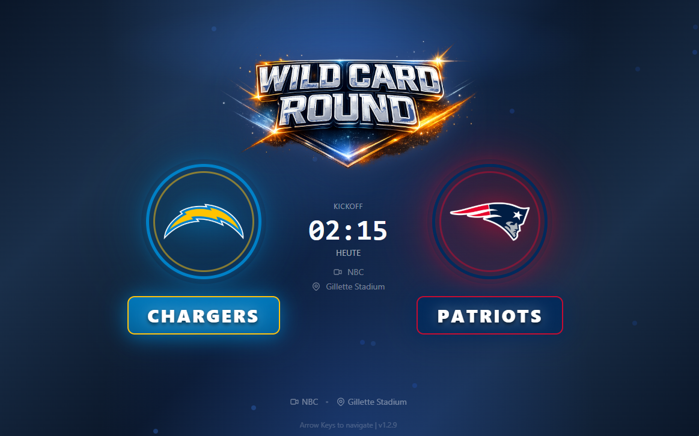
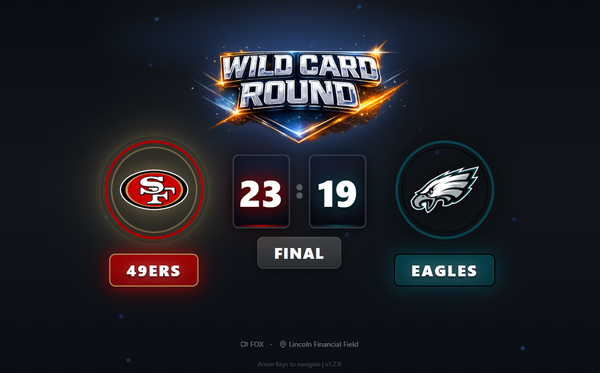
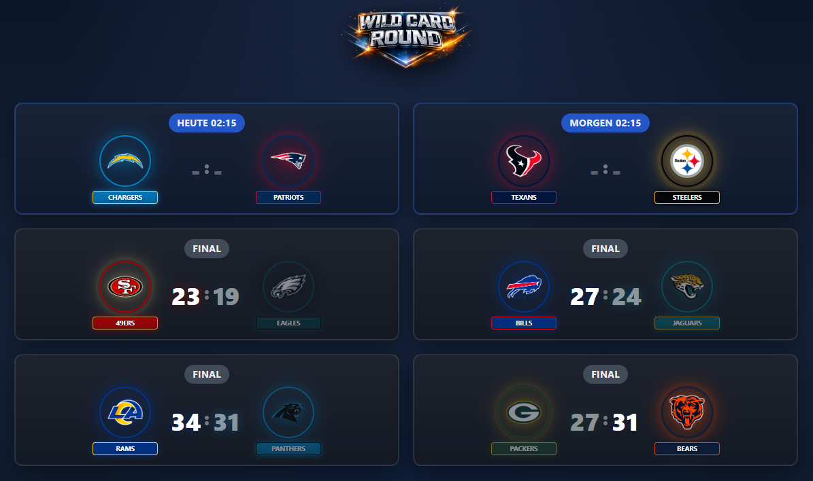

# ⚽🏈 Sport-Scoreboard

**Multi-Sport Live Scoreboard for iPad mini 6 and Video Wall Display**

A modern, responsive web application for displaying live NFL and Bundesliga games with dynamic backgrounds, team logos, statistics, celebration videos, and German localization.


> **What's New in v3.1.1:** Code cleanup (removed 530 lines of redundant code), Fixed all TypeScript 'any' types, Logo updates, Improved type safety

---

## 📋 Table of Contents

- [Screenshots](#-screenshots)
- [Features](#-features)
- [Usage](#-usage)
- [Tech Stack](#-tech-stack)
- [Installation](#-installation)
- [Getting Started](#-getting-started)
- [Deployment](#-deployment)
- [Project Structure](#-project-structure)
- [Configuration](#-configuration)
- [Development](#-development)
- [API](#-api)
- [License](#-license)

---

## 🖼 Screenshots

### SingleView - Upcoming Game
Detailed view of an upcoming game with scheduled time and venue information.



### SingleView - Live Game
Live game view with pulsing indicator, game clock, quarter information, and current game situation.


### SingleView - Final Game
Final result with winner highlighting and summary.



### MultiView - All Games
Overview of all games with dynamic card sizing and filters.



---

## ✨ Features

### 🎮 Display Modes

#### SingleView
- **Full-screen view** of a single game
- **Large team logos** with dynamic glow effects based on team colors
- **Team names** in large, readable font
- **Live game clock** with quarter/period display and pulsing indicator
- **Game situation** - Down, distance, yard line, possession with team logo
- **Detailed statistics** - Team stats, player stats, drive charts
- **Dynamic backgrounds** based on game status and type

#### MultiView
- **All games at a glance** in a 2-column grid
- **Dynamic card sizing** - adapts to the number of games:
  - 1-6 games: Large cards (165px) with bigger logos
  - 7-10 games: Medium cards (150px)
  - 11+ games: Compact cards (135px)
- **Filter options** - Live, Upcoming, Final games
- **Score change detection** - Cards with recent score changes glow red
- **Scoring team highlight** - Logo and team name of scoring team glow in team colors for 30 seconds
- **Status badges** - Live, Halftime, Final, Scheduled
- **Direct game selection** - Click on card to switch to SingleView

### 🎉 Celebration Features

- **Automatic celebration videos** on score changes:
  - 🏈 Touchdown (6, 7, 8 points)
  - 🥅 Field Goal (3 points)
  - 🛡️ Safety (2 points)
  - 🏃 Interception Return TD
  - 💥 Sack
  - 🎾 Fumble Recovery
- **Individual control** - Videos can be enabled/disabled individually
- **Volume control** - Adjustable video sound (0-100%)
- **Sound effects** - Separate audio effects for big plays

### 🎨 Visual Features

#### Custom Title Graphics
Professional PNG graphics for each game type:
- 🏆 **Super Bowl** with golden glow
- 🥈 **Conference Championship** with silver glow
- 🔵 **Divisional Round**
- 🃏 **Wild Card**
- 🏈 **Game Day** (Regular Season)

#### Dynamic Backgrounds
Different gradient designs based on game type:
- 🏆 **Super Bowl**: Gold/champagne with confetti animation
- 🥈 **Championship**: Silver/platinum with particles
- 🔴 **Live games**: Red pulsing energy overlay
- 🔵 **Playoffs**: Blue gradients with particle effects
- ⚫ **Final**: Dimmed dark tones
- 📅 **Scheduled**: Professional blue

#### Team Representation
- **Intelligent glow effects** - Automatic detection of dark colors and use of alternate color
- **Team color boxes** - Names in team colors with glow background
- **Winner highlighting** - Winning team is highlighted in final games
- **Transparency effects** - Losing team is dimmed in final games
- **Scoring animations** - Team logo and name glow in team colors when scoring (30 seconds)

### 🎯 Data & Updates

- **Live updates** from ESPN API:
  - Live games: 10 seconds
  - Scheduled games: 1 minute
  - Final games: 5 minutes
- **Automatic playoff detection** - Wild Card, Divisional, Championship & Super Bowl
- **German localization** - Date/time in DD.MM.YYYY and 24h format
- **Intelligent week selection** - Automatically searches multiple weeks for empty game days
- **Server-side caching** - Reduces API calls (15s TTL for live data, 5m for schedules)

### ⚙️ Settings & Customization

#### Game Selection
- **Manual game selection** with preview cards
- **Filter by status** - Live, Upcoming, Final
- **2-column layout** for better overview
- **Status display** with icons and timestamps
- **Automatic live detection** - Automatically shows first live game

#### Display Options
- **View mode toggle** - SingleView / MultiView
- **MultiView filters** - Separate filters for Live/Upcoming/Final games
- **Celebration videos** - Individually enable/disable
- **Sound control** - Sound effects and video volume

#### Debug Mode
- **Score manipulation** - For testing purposes
- **Status changes** - Change game status
- **Quick testing** - Fast testing of celebrations and UI changes

### 📱 Navigation & Controls

- **Arrow key navigation**:
  - ⬅️ Left: Previous game / Back to scoreboard
  - ➡️ Right: Next game / To statistics / To settings
  - ESC: Back to scoreboard
- **Swipe gestures** for touch devices (iPad):
  - Swipe left: Previous game
  - Swipe right: Next game
- **Click/Touch navigation**:
  - MultiView: Click game cards
  - Settings: Game selection, filters, options

### 🖥 Optimized for

- **iPad mini 6** in landscape mode (1024x768)
- **Video wall** - High-quality graphics for large displays
- **All modern browsers** - Chrome, Safari, Firefox, Edge
- **Touch-optimized** - Large touch targets, swipe gestures
- **Performance** - Optimized rendering performance, browser cache

---

## 🎮 Usage

### Getting Started

1. **Open app** - Browser to `http://<SERVER-IP>:3001`
2. **Automatic display** - App automatically shows first live game or next upcoming game
3. **Navigation** - Use arrow keys (desktop) or swipe gestures (iPad) to switch between views

### View Modes

#### SingleView (Default)
- **Main view**: Shows a single game in fullscreen
- **Navigation**:
  - Up arrow → Statistics panel
  - Right arrow → Settings
  - Left arrow → Back
- **Live updates**: Automatic refresh every 10 seconds for live games

#### MultiView
- **Overview**: All games at a glance
- **Filters**: Live, Upcoming, Final games controlled via settings
- **Selection**: Click on game card to switch to SingleView
- **Score changes**: Cards with recent score changes glow red
- **Scoring highlights**: Logo and team name of scoring team glow in team colors

### Settings Menu

Access via right arrow (2x) or Settings button:

#### View Mode
- **SingleView**: Shows a single game in detail
- **MultiView**: Overview of all games

#### MultiView Filters
For MultiView mode:
- ✅ **Live**: Shows ongoing games and halftime
- ✅ **Upcoming**: Shows scheduled, future games
- ✅ **Final**: Shows completed games

#### Select Game
- **Game selection**: List of all available games
- **2-column layout**: Better overview
- **Filter**: Respects MultiView filter settings
- **Status display**: Live, Upcoming, Final with icons
- **Direct display**: Selected game is immediately displayed

#### Sound
- **Sound Effects**: Enable/disable audio effects for touchdowns, field goals
- **Video Volume**: Volume for celebration videos (0-100%)

#### Celebration Videos
Individual control for each video:
- 🏈 **Touchdown**: 6, 7, 8 points
- 🥅 **Field Goal**: 3 points
- 🛡️ **Safety**: 2 points
- 🏃 **Interception**: Interception Return TD
- 💥 **Sack**: Quarterback Sack
- 🎾 **Fumble**: Fumble Recovery

#### Debug Mode
For developers and testing:
- **Score manipulation**: +/- points for teams
- **Status changes**: Change game status (Pre, Live, Final)
- **Quick testing**: Test celebration videos and UI changes

### Keyboard Shortcuts

| Key | Function |
|-----|----------|
| ⬅️ | Previous game / Back |
| ➡️ | Next game / Settings |
| ⬆️ | Statistics |
| ESC | Back to scoreboard |

### Touch Gestures (iPad)

| Gesture | Function |
|---------|----------|
| Swipe left | Previous game |
| Swipe right | Next game |
| Tap game card | Select game (MultiView) |

### Tips & Tricks

1. **Clear cache**: On issues do hard refresh (CMD+Shift+R) or clear cache
2. **Automatic live display**: App automatically switches to first live game
3. **Manual selection**: Via Settings → Select Game to pin a specific game
4. **MultiView for overview**: Ideal to keep track of all games
5. **SingleView for details**: Best view for a single game with all details
6. **Celebration videos**: Disable individual videos if problems occur
7. **Use filters**: In MultiView show only relevant games (e.g., only Live)
8. **Scoring highlights**: Watch for glowing team logos/names when teams score

---

## 🛠 Tech Stack

### Frontend
- **React 18.3.1** - UI Library
- **TypeScript** - Type Safety
- **Vite 6.0** - Build Tool & Dev Server
- **Tailwind CSS 3.4** - Utility-First CSS
- **Zustand 5.0** - State Management with Persist Middleware

### Backend
- **Express 4.21** - Proxy Server
- **Node.js** - Runtime
- **TSX** - TypeScript Execution

### APIs & Services
- **ESPN API** - Live NFL data
  - `/scoreboard` - Current scores
  - `/schedule` - Season schedule & playoff weeks
  - `/summary` - Detailed game statistics
- **OpenLigaDB API** - Bundesliga data (primary)
  - Match results, goals, cards, events
  - Polling interval: 15 seconds (1000 req/hour limit)
- **API-Football** - Bundesliga live minutes (optional)
  - Accurate match minute sync for live games
  - Free tier: 100 requests/day
  - Phase-based polling: 10min normal, 1min critical (injury time, restarts)
  - See [Bundesliga Setup](#bundesliga-api-setup) for configuration

### Tools & DevOps
- **ESLint** - Code Linting
- **PostCSS & Autoprefixer** - CSS Processing
- **Concurrently** - Parallel script execution
- **Git** - Version Control
- **PM2** - Process Manager for production

---

## 📦 Installation

### Prerequisites
- **Node.js** >= 18.0.0
- **npm** >= 9.0.0
- **Git**

### Step 1: Clone repository
```bash
git clone https://github.com/GhostTalker/nfl-scoreboard.git
cd nfl-scoreboard
```

### Step 2: Install dependencies
```bash
npm install
```

---

## 🚀 Getting Started

### Development Mode
Starts Vite Dev Server (Port 5173) + Express Proxy (Port 3001):

```bash
npm run start
```

Open browser: `http://localhost:5173`

### Production Build
```bash
npm run build
```

Output: `dist/` directory

### Start Production Server
```bash
NODE_ENV=production npm run start:prod
```

Server runs on: `http://localhost:3001`

---

## ⚽ Bundesliga API Setup

The Bundesliga plugin uses a **hybrid API approach** for optimal accuracy and cost-efficiency:

### Primary API: OpenLigaDB (Free, Required)
- Provides match results, goals, cards, and events
- Polled every **15 seconds** during live matches
- No API key required
- Rate limit: 1000 requests/hour (community project)

### Secondary API: API-Football (Optional, Recommended)
- Provides accurate **live match minutes** for running games
- Fixes issues with delayed kickoffs, interruptions, and injury time
- Free tier: **100 requests/day**
- Smart polling strategy:
  - **Normal phases (0-44, 51-89 min):** 10-minute interval
  - **Critical phases (injury time, restarts):** 1-minute interval
  - Typical Saturday matchday: ~75 requests

### Setup Instructions

#### 1. Without API-Football (Basic)
The app works without API-Football, but match minutes are **estimated** based on:
- Kickoff time + elapsed time
- Last goal minute (from OpenLigaDB)

This can lead to inaccuracies during:
- Delayed kickoffs
- Match interruptions (VAR, injuries)
- Injury time variations
- Second-half restart delays

#### 2. With API-Football (Recommended)
For accurate live minutes, sign up for a free API key:

1. Go to [API-Football](https://www.api-football.com/)
2. Create a free account (100 requests/day)
3. Copy your API key from the dashboard
4. Create a `.env` file in the project root:
   ```bash
   cp .env.example .env
   ```
5. Add your API key:
   ```env
   VITE_API_FOOTBALL_KEY=your_api_key_here
   ```
6. Restart the development server

**Note:** The `.env` file is git-ignored and will not be committed.

### How It Works

The hybrid system intelligently combines both APIs:

```
OpenLigaDB (every 15s)          API-Football (phase-based)
        ↓                                ↓
   Goals, Cards, Events          Live Match Minute
        ↓                                ↓
        └────────→ Merged Game Data ←────┘
                         ↓
              Accurate Live Display
```

**Match Minute Priority:**
1. **API-Football sync** + elapsed time since sync (most accurate)
2. **Last goal minute** (from OpenLigaDB) + elapsed time
3. **Kickoff time** + elapsed time (fallback)

**Request Budget (Saturday with 3 timeslots):**
- Normal phases: 3 timeslots × 5 checks = 15 requests
- Critical phases: 3 timeslots × 20 checks = 60 requests
- **Total: ~75 requests** (within 100/day limit)

---

## 🌐 Deployment

### Automatic Deployment (Recommended)

The project includes a deployment script for quick updates:

```bash
# On the server
cd /srv/GhostGit/nfl-scoreboard
./deploy.sh
```

The script automatically executes:
1. `git pull origin master` - Fetch latest changes
2. `npm install` - Update dependencies
3. `npm run build` - Create production build
4. `pm2 restart ecosystem.config.cjs` - Restart server

### Manual Deployment

#### Initial Setup
```bash
# SSH to server
ssh user@linux-server

# Clone project
cd /srv/GhostGit
git clone https://github.com/GhostTalker/nfl-scoreboard.git
cd nfl-scoreboard

# Install dependencies
npm install

# Create build
npm run build
```

#### Start Production
```bash
NODE_ENV=production npm run start:prod
```

#### Update Process
```bash
cd /srv/GhostGit/nfl-scoreboard
git pull
npm install
npm run build
NODE_ENV=production npm run start:prod
```

#### With PM2 (Recommended)
```bash
# Install PM2
npm install -g pm2

# Start app
pm2 start npm --name "nfl-scoreboard" -- run start:prod

# Auto-start on server restart
pm2 startup
pm2 save

# Check status
pm2 list
pm2 logs nfl-scoreboard
```

### Access
- **Local**: `http://localhost:3001`
- **Network**: `http://<YOUR-SERVER-IP>:3001`
- **iPad**: Browser to `http://<YOUR-SERVER-IP>:3001`

---

## 📁 Project Structure

```
nfl-scoreboard/
├── public/                  # Static Assets
│   ├── videos/              # Celebration Videos
│   │   ├── touchdown.mp4
│   │   ├── fieldgoal.mp4
│   │   ├── interception.mp4
│   │   ├── sack.mp4
│   │   ├── fumble.mp4
│   │   └── safety.mp4
│   ├── title/               # Title Graphics (PNG)
│   │   ├── superbowl.png
│   │   ├── conference.png
│   │   ├── divisional.png
│   │   ├── wildcard.png
│   │   └── gameday.png
│   ├── screenshots/         # App Screenshots
│   │   ├── singleview_upcomming.png
│   │   ├── singleview_final.png
│   │   └── multiview.png
│   └── favicon.svg
├── server/                  # Express Backend
│   ├── index.ts             # Main Server
│   ├── routes/
│   │   └── api.ts           # API Routes
│   └── services/
│       └── espnProxy.ts     # ESPN API Proxy with Caching
├── src/                     # React Frontend
│   ├── components/
│   │   ├── scoreboard/      # Scoreboard Components
│   │   │   ├── MainScoreboard.tsx
│   │   │   ├── MultiGameView.tsx
│   │   │   ├── TeamDisplay.tsx
│   │   │   ├── GameSituation.tsx
│   │   │   └── VideoOverlay.tsx
│   │   ├── settings/        # Settings Panel
│   │   │   ├── SettingsPanel.tsx
│   │   │   ├── GameSelector.tsx
│   │   │   ├── CelebrationSettings.tsx
│   │   │   └── DebugControls.tsx
│   │   └── stats/           # Statistics
│   │       └── StatsPanel.tsx
│   ├── hooks/               # Custom React Hooks
│   │   ├── useGameData.ts
│   │   ├── useSwipe.ts
│   │   ├── useKeyboardNavigation.ts
│   │   └── useScoreChange.ts
│   ├── stores/              # Zustand State Management
│   │   ├── gameStore.ts     # Game Data & Selection
│   │   ├── settingsStore.ts # User Settings & Preferences
│   │   └── uiStore.ts       # UI State & View Mode
│   ├── services/            # API Services
│   │   └── espnApi.ts       # ESPN API Integration
│   ├── types/               # TypeScript Types
│   │   ├── game.ts
│   │   ├── stats.ts
│   │   └── settings.ts
│   ├── constants/           # Constants
│   │   ├── teams.ts
│   │   ├── videos.ts
│   │   ├── titleGraphics.ts
│   │   └── api.ts
│   ├── utils/               # Utility Functions
│   ├── App.tsx              # Main App Component
│   ├── main.tsx             # Entry Point
│   └── index.css            # Global Styles
├── dist/                    # Build Output (gitignored)
├── node_modules/            # Dependencies (gitignored)
├── deploy.sh                # Deployment Script
├── ecosystem.config.cjs     # PM2 Configuration
├── package.json             # NPM Config
├── tsconfig.json            # TypeScript Config
├── vite.config.ts           # Vite Config
├── tailwind.config.js       # Tailwind Config
├── eslint.config.js         # ESLint Config
└── README.md                # This file
```

---

## ⚙️ Configuration

### Environment Variables
No environment variables required. All configurations are in code files.

### API Endpoints (server/routes/api.ts)
```typescript
GET /api/scoreboard                    // Current week
GET /api/scoreboard?week=X             // Specific week
GET /api/schedule?year=Y&week=X        // Schedule
GET /api/game/:id                      // Game details
GET /api/health                        // Health check + cache stats
```

### Default Settings (src/types/settings.ts)
```typescript
primaryTeamId: '17'               // New England Patriots
soundEffectsEnabled: true         // Sound effects enabled
videoVolume: 0.8                  // 80% volume
viewMode: 'single'                // SingleView as default
multiViewFilters: {
  showLive: true,                 // Show live games
  showUpcoming: true,             // Show scheduled games
  showFinal: true                 // Show final games
}
celebrationVideos: {
  touchdown: true,
  fieldgoal: true,
  interception: true,
  sack: true,
  fumble: true,
  safety: true
}
```

### Cache Configuration (server/services/espnProxy.ts)
```typescript
Live Data TTL: 15 seconds
Schedule Data TTL: 5 minutes
```

### Polling Intervals (src/hooks/useGameData.ts)
```typescript
Live Games: 10 seconds
Scheduled Games: 1 minute
Final Games: 5 minutes
```

---

## 💻 Development

### Start Dev Server
```bash
npm run dev
# or
npm run start  # Also starts Express Proxy
```

### Linting
```bash
npm run lint
```

### Build
```bash
npm run build
```

### TypeScript Check
```bash
npx tsc --noEmit
```

### Code Style Guidelines
- **Imports**: Standard Library → Third-Party → Local
- **Naming**: camelCase for variables/functions, PascalCase for components
- **TypeScript**: Explicit types, no `any`
- **Components**: Functional components with hooks
- **State**: Zustand for global state, useState for local state
- **Tailwind**: Utility-first, no custom CSS unless absolutely necessary

---

## 🔌 API

### ESPN API Integration

The app uses the ESPN API for live data. The Express server acts as a proxy with server-side caching.

#### Scoreboard Endpoint
```typescript
GET /api/scoreboard?week=1

Response:
{
  "events": [{
    "id": "401671723",
    "name": "Team A at Team B",
    "date": "2024-09-09T01:20Z",
    "seasonName": "WILD CARD",
    "competitions": [{
      "competitors": [{
        "team": { "id": "17", "abbreviation": "NE", ... },
        "score": "14"
      }],
      "status": {
        "type": { "state": "in", "completed": false },
        "period": 3,
        "displayClock": "12:34"
      }
    }]
  }]
}
```

#### Game Details Endpoint
```typescript
GET /api/game/401671723

Response:
{
  "boxscore": {
    "teams": [{
      "team": { "id": "17", ... },
      "statistics": [
        { "name": "totalYards", "displayValue": "342" },
        { "name": "passingYards", "displayValue": "245" }
      ]
    }]
  },
  "drives": { ... }
}
```

---

## 🐛 Known Issues & Solutions

### Browser Cache on iPad
- **Problem**: iPad sometimes aggressively caches old versions
- **Solution**:
  1. Hard refresh: Safari settings → Clear history
  2. Use private mode
  3. "Without content blockers" at reload button (hold)

### Delayed Live Updates
- **Note**: API updates based on game status
- **Normal**: 10 seconds for live, 1 minute for scheduled
- **Adjustment**: Change interval in `src/hooks/useGameData.ts`

### Celebration Videos Not Playing
- **Possible causes**:
  1. Browser autoplay policy
  2. Videos not in `public/videos/` folder
  3. Video format not supported
- **Solution**:
  1. User interaction required (first action)
  2. Place videos in correct folder
  3. Use MP4 format (H.264 codec)

---

## 🤝 Contributing

Contributions are welcome! Please:

1. Fork the repository
2. Create a feature branch (`git checkout -b feature/AmazingFeature`)
3. Commit your changes (`git commit -m 'Add: AmazingFeature'`)
4. Push to the branch (`git push origin feature/AmazingFeature`)
5. Open a pull request

### Commit Message Format
```
feat(scope): add new feature
fix(scope): fix bug
docs: update README
style: format code
refactor: restructure code
test: add tests
chore: update dependencies
```

---

## 📄 License

This project is licensed under the **MIT License**.

---

## 👤 Author

**GhostTalker**

- GitHub: [@GhostTalker](https://github.com/GhostTalker)
- Repository: [nfl-scoreboard](https://github.com/GhostTalker/nfl-scoreboard)

---

## 🙏 Acknowledgments

- **ESPN API** for the live data
- **React Team** for the great framework
- **Tailwind CSS** for the utility-first CSS framework
- **Vite** for the lightning-fast build process
- **Zustand** for simple state management

---

## 📝 Changelog

### v2.0.8 (2026-01-16)
- 🐛 **Critical Bugfix - Bundesliga Loading**
  - ✅ Fixed race condition in setInitialSportSelection
    - Now sets currentSport, currentCompetition, and hasSelectedInitialSport in ONE atomic update
    - Prevents useGameData from fetching before competition is properly set
    - Bundesliga games now load immediately when selected
- 🎨 **Updated Sport Selection Screen Graphics**
  - ✅ Main title now uses `/title/scoreboard-logo.png`
  - ✅ NFL card now uses `/title/nfl-logo.png`
  - ✅ Bundesliga card now uses `/title/bundesliga-logo.png`
  - Professional PNG graphics replace SVG icons

### v2.0.7 (2026-01-16)
- 🐛 **Critical Bugfixes**
  - ✅ Fixed sport selection screen - now shows again for all users
    - Migration version upgraded to 7
    - Forces all users to see sport selection on next visit
  - ✅ Fixed Bundesliga games loading on initial selection
    - Changed navigation from Settings to Scoreboard after sport selection
    - Games now load immediately when Bundesliga is selected
- 🎨 **Team Color Corrections**
  - ✅ Hamburger SV - Already correct (Blue)
  - ✅ SC Freiburg - Changed from Red to Black/White
  - ✅ Eintracht Frankfurt - Changed from Red to Black/Red
  - ✅ RB Leipzig - Changed from Red to White/Red

### v2.0.6 (2026-01-16)
- 🐛 **Critical Bugfixes**
  - ✅ Fixed SingleView - GameSituation no longer disappears after few seconds
    - Preserved `situation` field when merging game details
    - Situation data now persists across API updates
  - ✅ Fixed MultiView - Score colons now vertically aligned
    - Changed from Flexbox to CSS Grid layout (grid-cols-[1fr_auto_1fr])
    - Score section always centered regardless of team name box heights
  - ✅ Fixed DebugPanel - Added Bundesliga graphics testing
    - NFL Season Types: Game Day, Preseason, Wild Card, Divisional, Conference, Super Bowl
    - Bundesliga Season Types: Bundesliga, DFB-Pokal, DFB-Pokal Finale
- 🏆 **DFB-Pokal Finale Detection**
  - ✅ Automatic detection when only 1 game in round AND venue is Berlin
  - ✅ Shows special `dfbpokalfinale.png` title graphic for finale
  - ✅ Works in both SingleView and MultiView

### v2.0.5 (2026-01-16)
- 🎨 **UI Fixes**
  - ✅ Fixed MultiView grid - all boxes now equal size (removed col-span-2)
  - ✅ Last odd game no longer spans full width
- 🖼️ **Logo Fixes**
  - ✅ St. Pauli logo - now uses local `/logo/st-pauli.png`
  - ✅ Union Berlin logo - now uses local `/logo/union.png`
  - ✅ No more CORS issues or white backgrounds
- 🏆 **Title Graphics**
  - ✅ Bundesliga games use `/title/bundesliga.png`
  - ✅ DFB-Pokal games use `/title/dfbpokal.png`
  - ✅ DFB-Pokal Finale uses `/title/dfbpokalfinale.png`
- 🚀 **Sport Selection Screen**
  - ✅ FIXED: Now force-shows for ALL users on hard-refresh
  - ✅ Migration version upgraded to 6
  - ✅ Removes cached `hasSelectedInitialSport` value

### v2.0.4 (2026-01-16)
- 🐛 **Critical Bugfixes**
  - ✅ Fixed St. Pauli logo - now uses correct Wikipedia PNG (team ID 98)
  - ✅ Fixed Union Berlin logo - transparent PNG without white background
  - ✅ Fixed MultiView title - shows "BUNDESLIGA" or "DFB-POKAL" instead of "GAMEDAY"
  - ✅ Fixed DFB-Pokal loading - competition switch now loads correct games
  - ✅ Fixed MultiView grid symmetry - last odd game now spans full width
  - ✅ Fixed sport selection screen - now always appears on hard-refresh
- ⚽ **Bundesliga Improvements**
  - ✅ Competition change listener in useGameData - live reloading on competition switch
  - ✅ Competition-based filtering after fetchScoreboard()
  - ✅ Migration forces all users through sport selection screen (better onboarding)

### v2.0.3 (2026-01-16)
- ⚽ **DFB-Pokal Support**
  - ✅ Fixed DFB-Pokal showing separate games from Bundesliga
  - ✅ Adapter now fetches both Bundesliga (bl1) and DFB-Pokal (dfb) games
  - ✅ Competition filter in useGameData filters games correctly
  - ✅ Both competitions work independently
- 🏴‍☠️ **St. Pauli Fix**
  - ✅ Created custom St. Pauli logo (SVG) to fix CORS issues
  - ✅ Team ID 98 now displays correct brown color (#6A4029)
  - ✅ Local logo fallback for reliable display
- 📱 **Dynamic Browser Title**
  - ✅ Title updates based on selected sport (NFL/Bundesliga)
  - ✅ Clears browser cache issues
- 🖼️ **Title Graphics**
  - ✅ Bundesliga and DFB-Pokal SVG graphics display correctly
  - ✅ Fixed fallback logic in getTitleGraphic()

### v2.0.2 (2026-01-16)
- ⚽ **Bundesliga Improvements**
  - ✅ Fixed St. Pauli team ID (98) and colors (brown)
  - ✅ Corrected all Bundesliga team IDs to match OpenLigaDB
  - ✅ Dynamic season calculation (auto-detects 2025/2026 season)
  - ✅ Added Bundesliga and DFB-Pokal title graphics (SVG)
- 🎨 **Rebranding**
  - ✅ Renamed from "NFL Scoreboard" to "Sport-Scoreboard"
  - ✅ Updated all documentation and UI text
  - ✅ Multi-sport branding throughout the app
- 🖼️ **Sport Selection Screen**
  - ✅ Replaced emoji icons with custom SVG graphics
  - ✅ Better visibility and professional look
  - ✅ Football and soccer ball icons

### v2.0.1 (2025-01-16)
- 🐛 **Bundesliga Bugfixes**
  - ✅ Fixed OpenLigaDB API property casing issues (camelCase vs PascalCase)
  - ✅ Added explicit season parameter (2024) to matchday API requests
  - ✅ Bundesliga games now display correctly for current matchday
  - ✅ DFB-Pokal competition support working
- 🎮 **Debug Controls**
  - ✅ Sport-aware celebration buttons (NFL vs Bundesliga)
  - ✅ Dynamic API status display (ESPN API vs OpenLigaDB API)
  - ✅ Fixed period display for both sports
- 🎨 **Onboarding**
  - ✅ Initial sport selection screen for new users
  - ✅ Beautiful card-based UI with sport logos
  - ✅ Existing users automatically skip onboarding

### v2.0.0 (2025-01-13)
- 🌍 **Multi-Sport Support**
  - ✅ Complete multi-sport architecture with NFL and Bundesliga support
  - ✅ Two-tier sport selection: Sport (NFL/Bundesliga) → Competition (Bundesliga/DFB-Pokal)
  - ✅ Polymorphic type system with discriminated unions (NFLGame | BundesligaGame)
  - ✅ Sport adapter pattern for clean abstraction
  - ✅ 100% NFL functionality preserved - parallel operation
- ⚽ **Bundesliga Integration**
  - ✅ OpenLigaDB API integration with 15-second caching
  - ✅ Live matchday data for Bundesliga and DFB-Pokal
  - ✅ All 18 Bundesliga teams with authentic team colors
  - ✅ Soccer-specific features: matchday structure, goals tracking, cards
  - ✅ Extended celebration types: goals, penalties, own goals, red/yellow cards
- 🎨 **UI Enhancements**
  - ✅ New SportSelector component for sport/competition switching
  - ✅ Dynamic celebration settings that adapt to selected sport
  - ✅ Sport-aware data fetching with automatic state clearing on switch
- 🏗️ **Architecture**
  - ✅ Created 10 new files (adapters, types, components, services)
  - ✅ Modified 15 existing files with type guards and sport awareness
  - ✅ Backend multi-sport routing with separate proxy services
  - ✅ Enhanced health endpoint with cache stats for both sports

### v1.5.0 (2025-01-12)
- 🎬 **Celebration Updates**
  - ✅ Disabled video overlays in MultiView mode
  - ✅ Videos now only play in SingleView for focused experience
- ✨ **Scoring Glow Effect in SingleView**
  - ✅ Scoring team's logo glows brighter with enhanced team colors (30 seconds)
  - ✅ Scoring team's name box pulses and glows with team colors (30 seconds)
  - ✅ Smooth pulsing animation (animate-pulse)
  - ✅ No logo darkening - only enhanced glow effects
  - ✅ Auto-clears after 30 seconds

### v1.4.0 (2025-01-12)
- 🎨 **Visual Improvements**
  - ✅ Changed live game background from red to professional dark blue
  - ✅ Blue energy particles for live games instead of red
  - ✅ Uniform game selection box sizes in settings
- 📚 **Documentation**
  - ✅ Fixed keyboard navigation documentation (Up arrow → Statistics)
  - ✅ Added missing SingleView Live screenshot to README
  - ✅ Corrected all screenshot descriptions

### v1.3.0 (2025-01-12)
- 🎯 **MultiView Enhancements**
  - ✅ Perfect vertical and horizontal centering on all devices (incl. iPad)
  - ✅ Filters always visible in settings menu
  - ✅ Larger title graphic (h-48) for better visibility
  - ✅ **Scoring team highlights** - Logo and team name glow in team colors when scoring (30 seconds)
- 🔧 **Bug Fixes**
  - ✅ Centering on iPad corrected
  - ✅ MultiView filters now always visible, not just in multi-mode
- 📚 **Documentation**
  - ✅ Complete README overhaul with comprehensive usage guide
  - ✅ Added screenshots (SingleView, MultiView)
  - ✅ English translation

### v1.2.9 (2025-01-12)
- 🎯 **MultiView Improvements**
  - ✅ Perfect vertical and horizontal centering on all devices
  - ✅ Filters always visible in settings menu
  - ✅ Larger title graphic

### v1.2.8 (2025-01-12)
- 🎯 **Layout Improvements**
  - ✅ Vertical centering in MultiView game cards
  - ✅ Horizontal scaling on hover (scale-x)
  - ✅ Optimized alignment for iPad

### v1.2.7 (2025-01-12)
- 🎨 **Visual Updates**
  - ✅ Larger title graphic in MultiView (h-40)

### v1.2.6 (2025-01-12)
- 🔧 **Game Selector Fixes**
  - ✅ Uniform box sizes for all games
  - ✅ Horizontal scrollbar prevented

### v1.2.5 (2025-01-12)
- 🎨 **Game Selector Improvements**
  - ✅ Larger logos (10x10) instead of abbreviations
  - ✅ Full team names (shortDisplayName)
  - ✅ Better readability through more padding

### v1.2.4 (2025-01-12)
- 🎯 **Filter & Layout**
  - ✅ MultiView filters applied to game selector
  - ✅ "Single Game" renamed to "SingleView"
  - ✅ Compact 2-column view in game selector

### v1.2.3 (2025-01-12)
- 🎨 **Naming & UX**
  - ✅ "All Games" renamed to "MultiView"
  - ✅ Filters arranged horizontally below MultiView button

### v1.2.2 (2025-01-12)
- 🎯 **MultiView Features**
  - ✅ Filters moved to settings (Live, Upcoming, Final)
  - ✅ Dynamic box sizes based on game count
  - ✅ Persistent filter settings

### v1.2.1 (2025-01-12)
- 🎮 **MultiView Mode**
  - ✅ All games at a glance
  - ✅ 2-column grid layout
  - ✅ Compact design for up to 14 games
  - ✅ Score change detection with red highlight
  - ✅ Auto-close settings on view mode change

### v1.0.1 (2025-01-07)
- ✨ **Custom Title Graphics** - PNG graphics replace text titles
  - 🏆 Super Bowl with golden glow effect
  - 🥈 Conference Championship with silver glow
  - 🔵 Divisional Round graphic
  - 🃏 Wild Card graphic
  - 🏈 Game Day graphic for Regular Season
- ✅ Fallback to text if graphic doesn't load
- ✅ Automatic graphic selection based on game type

### v1.0.0 (2025-01-07)
- ✨ Initial Release
- ✅ Live NFL Scoreboard with ESPN API
- ✅ German localization (DD.MM.YYYY, 24h)
- ✅ Playoff detection & automatic week selection
- ✅ Dynamic backgrounds based on game type
- ✅ CSS Grid for perfect centering
- ✅ Enlarged logos & names
- ✅ Game selector with swipe gestures
- ✅ Statistics panel
- ✅ Settings panel
- ✅ Responsive design for iPad mini 6
- ✅ Production-optimized build

---

## 🔮 Roadmap

### Implemented ✅
- [x] ~~Custom PNG Title Graphics~~ (v1.0.1)
- [x] ~~Celebration Videos~~ (v1.1.0)
- [x] ~~Sound Effects~~ (v1.1.0)
- [x] ~~Multi-Game-View~~ (v1.2.1)
- [x] ~~Individual Celebration Control~~ (v1.2.0)
- [x] ~~Game Filters~~ (v1.2.2)
- [x] ~~Scoring Team Highlights~~ (v1.3.0)

### Planned Features 🚧
- [ ] Better background graphics for video wall
- [ ] Enhanced stats visualization
- [ ] Drive charts
- [ ] Play-by-play display with timeline
- [ ] Theme customization
- [ ] Push notifications on score changes
- [ ] Favorite team highlighting
- [ ] Game replay / highlight clips
- [ ] Social media integration

---

**Made with ❤️ for NFL Fans**
